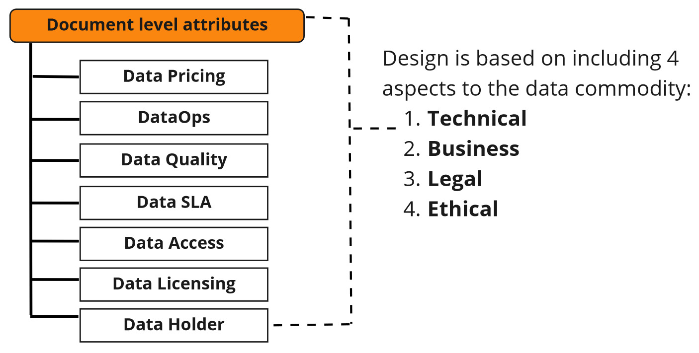

# OPEN DATA PRODUCT SPECIFICATION


## Development Version 

The key words “MUST”, “MUST NOT”, “REQUIRED”, “SHALL”, “SHALL NOT”, “SHOULD”, “SHOULD NOT”, “RECOMMENDED”, “NOT RECOMMENDED”, “MAY”, and “OPTIONAL” in this document are to be interpreted as described in BCP 14 [RFC2119] [RFC8174] when, and only when, they appear in all capitals, as shown here.

The specification is shared under <a href='https://creativecommons.org/licenses/by-sa/4.0/'>Attribution-ShareAlike 4.0 International (CC BY-SA 4.0)</a> license. 

Copyrights 2022 Mindmote Oy. Original creators of the specification: Jarkko Moilanen (igniter), Jussi Niilahti & Toni Luhti

**VERSION 2.0 DERIVED FROM THIS DEVELOPMENT VERSION IS PLANNED TO BE PUBLISHED 1st APRIL 2023**

**Latest version source:**

* <a href="https://github.com/Open-Data-Product-Initiative/open-data-product-spec-1.1dev">https://github.com/Open-Data-Product-Initiative/open-data-product-spec-1.1dev</a>

**Editors:**

* <a href="https://www.linkedin.com/in/jarkkomoilanen/">Jarkko Moilanen</a>
* <a href="https://www.linkedin.com/in/jussi-niilahti/">Jussi Niilahti</a>

**Participate:**

* [Raise an issue in Github](https://github.com/Data-Product-Business/open-data-product-spec-1.1dev/issues)
* [Raise an issue in service designed for average mortals](https://v90nkeo0oq0.typeform.com/to/Q1Zo6wE5) 

## Introduction

The Open Data Product Specification is a vendor-neutral, open-source machine-readable data product metadata model. It defines the objects and attributes as well as the structure of digital data products. The work is based on existing standards (schema.org), best practices and emerging concepts like Data Mesh. The reasoning is that we reuse and proudly copy instead of reinventing the wheel. More detailed information of the origin can be found from the [Open Data Product Specification homepage](https://www.dataproductbusiness.com/open-data-product-specification). 

The specification has been designed with four major aspects of the data product in mind: 1) technical (infrastructure & access), 2) business (pricing & plans), 3) legal (licensing & IPR), and 4) ethical (privacy & mydata). The four aspects are described in 6 elements, which contain attributes and other elements. 



**Specification aims:**

* enable interoperability between organizations, data platforms,  marketplaces, and tools. 
* reduce data product metadata conversions and errors between systems and organizations, 
* increase the speed of designing, testing, and implementing data products. 
* speed up tools development around data product design, development and management.
* enable creation of automated data product deployment with standard methods (DataOps)

**Note!** In the "Open Data Product" focus is on the latter words and the prefix  'open' refers to the openness of the standard. Any kind of connotations to open data (a different thing) are not intentional, intended, or desirable.

If you see something missing, described inaccurately or plain wrong, or you want to comment the specification, click the button below and proceed forward. 

<button data-tf-popup="Q1Zo6wE5" data-tf-iframe-props="title=Customer Feedback Survey" style="all:unset;font-family:Helvetica,Arial,sans-serif;display:inline-block;max-width:100%;white-space:nowrap;overflow:hidden;text-overflow:ellipsis;background-color:#FA6B05;color:#000000;font-size:17px;border-radius:3px;padding:0 28px;font-weight:bold;height:42.5px;cursor:pointer;line-height:42.5px;text-align:center;margin:0;text-decoration:none;">Raise an issue</button><script src="//embed.typeform.com/next/embed.js"></script>

## Document structure

**LEFT COLUMN: Navigation**

The left column is navigation which enables fluent and easy movement around the specification. 

**MIDDLE COLUMN: Principles and components**

The middle column contains detailed information about the included components and related options. This is the theory part. 

Note! Mandatory elements and attributes are listed separately in the definition tables. This enables user to construct minimum viable specification more easily and fast. https://schema.org provided ready-made definitions are applied when ever possible instead of re-inventing the wheel. 

**RIGHT COLUMN: Examples**

The right column contains JSON formatted examples of how the specification is used. In the future other output formats are added on request basis. 

> Example of JSON formatted snippet from the Open Data Product specification:

```javascript
"monitoring": {

  "url": "https://monitoring.com"
}
```

<aside class="notice">
The JSON examples are not based on any real data product, but exemplify the usage of Open Data Product Specification. 

</aside>


# Document level attributes

Here's the list of attributes which can occur at the document root level. In the following description, if a field is not explicitly **REQUIRED** or described with a MUST or SHALL, it can be considered OPTIONAL. Optional attributes are listed in own table and examples are given on the right column. 

## Mandatory attributes

> Example of document level attribute usage and structure:

```javascript
"Product": {
  "en": {
    "name": "Pets of the year",
    "productID": "123456are",
    "visibility": "private",
    "status": "draft",
    "type": "dataset"
  },
  "fi": {
    "name": "Vuoden suosituimmat lemmikit",
    "productID": "123456are",
    "visibility": "private",
    "status": "draft",
    "type": "dataset"
  }
}

```

| <div style="width:150px">Element name</div>   | Type  | Options  | Description  |
|---|---|---|---|
| **en** | element | [ISO 639-1](https://en.wikipedia.org/wiki/List_of_ISO_639-1_codes) defined 2-letter codes | **REQUIRED** - **NOTE! This is a dynamic element!** This element binds together other product attributes and expresses the langugage used. In the example this is "en", which indicates that product details are in English. If you would like to use French details, then name the element "fr". The naming of this element follows options (language codes) listed in [ISO 639-1](https://en.wikipedia.org/wiki/List_of_ISO_639-1_codes) standard. <br/><br/> You can have product details in multiple languages simply by adding similar sets like the example - just change the binding element name to matching language code. <br/><br/> The pattern to implement multilanguage support for data products was adopted from de facto UI translation practices. The attributes inside this element are commonly rendered in the UI for the consumer and providing a simple way to implement that was the driving reasoning. See for example  [JSON - Multi Language](https://simplelocalize.io/docs/file-formats/multi-language-json/) |
| **name** | string | max length 256 chars | **REQUIRED** The name of the product. |
| **productID**  | string | max length 256 chars | **REQUIRED** Product identifier. |
| **visibility**  | one of | one of: private, organisation, public | **REQUIRED** The publicity level eg who can see this product. Private - just the creator. Organisation - visible to all in your organisation. Public - visible to all publicly. |
| **status**  | one of | one of: announcement, draft, development, testing, acceptance, production, sunset, retired | **REQUIRED** The status of the product. Lifecycle model discussed in details in here (link). |
| **type** | one of |  Options: raw data, derived data, dataset, reports, analytic view, 3D visualisation, algorithm, decision support, automated decision-making, data-enhanced product, data-driven service, data-enabled performance, bi-directional. | **REQUIRED** The type of the product. Options are derived from examples and lists found from academic literature.  | 


## Optional attributes

RecommendedDataProducts **OBJECT** contains an array of data products which offers means to attach related data products to the data product at hand. The source of the recommended data product might be from the same marketplace/catalog or an external one. Recommended object offers method to extend the reach and promotion escpecially when data product is treated as an independent entity much like described in Data Mesh. Also when data product is published in a marketplace, the Recommended object offers means to promote other than just the data products from the given data marketplace. In short, tis object is mainly for discovery and reach purposes. 

RecommendedUseCases **OBJECT** is an array which contains offers method to attach usefull usecases to the data product. Usecases are informatiove for the the data customer and exemplify how the data product can create value. 

> Example of document level attribute usage and structure:

```javascript
"Product": {
    "en":{
      "name": "Pets of the year",
      "description": "This is an example of a Petstore product.",
      "productSeries": "Lovely pets data products",
      "visibility": "private",
      "versionNotes":"New version with additional details such more accurate pet details",
      "categories": ["pets"],
      "tags": ["pet"],
      "brandSlogan": "Passion for the data monetization",
      "logoURL": "https://data-product-business.github.io/open-data-product-spec/images/logo-dps-ebd5a97d.png",
      "productID": "123456are",
      "visibility": "private",
      "status": "draft",
      "version": "0.1",
      "standards": ["ISO 24631-6"],
      "contentSample":"https://download.com/pets.json", 
      "OutputFileFormats": [ 
              "JSON",
              "XML",
              "CSV",
              "ZIP",
              "PDF"
          ],
      "useCases": [
        {              
          "useCaseTitle":"Build attractive and lucrative petstore!",
          "useCaseDescription":"Use case description how succesfull petstore chain was established in Abu Dhabi",
          "useCaseURL":"https://marketplace.com/usecase1"     
        }
      ],
      "recommendedDataProducts": [
          "https://marketplace.com/dataproduct.json, https://marketplace.com/dataproduct-another.json"
          ]
  }
}

```

| <div style="width:150px">Element name</div>   | Type  | Options  | Description  |
|---|---|---|---|
| valueProposition | string  | text content, max length 512 chars  | This is the product's value proposition. Often one or two sentences and crystallizes the value for the customer. |
| description | string | - | The description of the product. Text only. |
| productSeries | string | - | A group of products in the product mix which are associated with each other and they can be obtained for the same type of customers or they are marketable for the same type of market place. |
| categories| array | - | Comma separates array of categories. |
| standards| array | - | Comma separates array of standards related e.g. to data content or quality, such as ISO 8000 or ISO 19131. |
| tags| array | - | Comma separates array of tags. |
| version | string | The versioning scheme is **major.minor.**. Examples: 1.0, 2.1, 3.15 | The version of the data product. Applies for OPDS metadata as well. |
| versionNotes | string | - | Additional information about the version |
| contentSample| URL | Valid URL. See more from [RFC 3986](https://datatracker.ietf.org/doc/html/rfc3986). | Sample content of the data product, for example JSON/XML output. This sample should match the actual data product output and give the data consumer an idea what to expect. Obviously if the data product is pure service for example dashboard or algorithm, then consider providing preview version or alike |
| logoURL| URL | Valid URL | Valid URL of the logo. See more from [RFC 3986](https://datatracker.ietf.org/doc/html/rfc3986). |
| outputFileFormats | string | - | Output file formats for data product |
| brandSlogan | string | - | Brand related slogan like Nike has *just do it*. |
| useCases | element | array | Contains list of related use cases with description information and link to details. **NOTE!** These examples are expected to use same language as defined previously in the data product details content binding element. |
| useCaseTitle| string | string | Title of the usecase. |
| useCaseDescription| string | string | Brief description of the usecase. |
| useCaseURL| URL | Valid URL, [RFC 3986](https://datatracker.ietf.org/doc/html/rfc3986) | Valid URL of the more detailed usecase description. |
| recommendedDataProducts | array | Array of valid URLs ([RFC 3986](https://datatracker.ietf.org/doc/html/rfc3986)) | Data products to recommend use next to this data product or even as replacement (for comparison). The URL provided MUST reference a description of a data product following this same standard |

<button data-tf-popup="Q1Zo6wE5" data-tf-iframe-props="title=Customer Feedback Survey" style="all:unset;font-family:Helvetica,Arial,sans-serif;display:inline-block;max-width:100%;white-space:nowrap;overflow:hidden;text-overflow:ellipsis;background-color:#FA6B05;color:#000000;font-size:17px;border-radius:3px;padding:0 28px;font-weight:bold;height:42.5px;cursor:pointer;line-height:42.5px;text-align:center;margin:0;text-decoration:none;">Raise an issue</button><script src="//embed.typeform.com/next/embed.js"></script>
